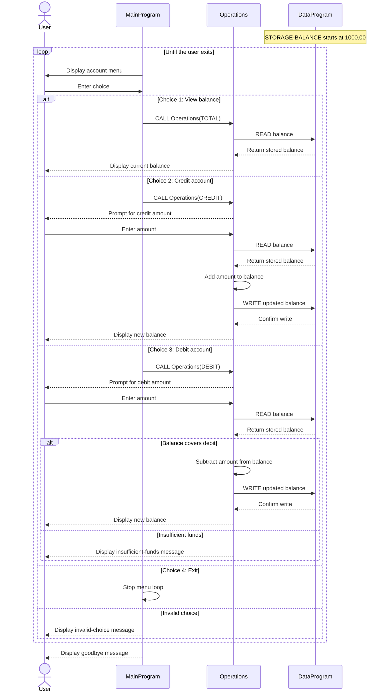

# COBOL Account Management

This directory documents the COBOL account-management example in `src/cobol`. The program provides a menu for viewing one account balance and crediting or debiting that balance.

## Source files

### `src/cobol/main.cob` — `MainProgram`

Runs the interactive menu and dispatches the selected action to `Operations`:

- `1` requests the current balance (`TOTAL`).
- `2` requests a credit (`CREDIT`).
- `3` requests a debit (`DEBIT`).
- `4` exits the program.
- Any other choice displays an invalid-choice message and returns to the menu.

### `src/cobol/operations.cob` — `Operations`

Implements the account actions. It reads the balance through `DataProgram` before a credit or debit, asks the user for an amount, and writes the updated balance after a successful change. Viewing the balance reads and displays it without writing it back.

The amount and balance fields use `PIC 9(6)V99`: six integer digits and two fractional digits, with an implied decimal point.

### `src/cobol/data.cob` — `DataProgram`

Provides the `READ` and `WRITE` operations used by `Operations`. `READ` copies the stored balance to the caller; `WRITE` copies the caller's balance into `STORAGE-BALANCE`.

The balance is held in COBOL working storage, not in a file or database. It is initialized to `1000.00` when the program runs, so changes are not retained after the process ends.

## Account rules in this example

- The account starts with a balance of `1000.00` each time the program runs.
- A credit adds the entered amount to the balance.
- A debit is accepted only when the current balance is greater than or equal to the entered amount. Otherwise, the program reports insufficient funds and leaves the balance unchanged.
- The program contains no explicit check that a credit or debit amount is positive.
- This example manages one generic account. It has no student identity, enrollment status, tuition, fee, financial-aid, or account-hold rules; those would need to be added for a student-account system.

## Call flow

`MainProgram` calls `Operations` with an action. `Operations` performs the requested action and calls `DataProgram` to read or update the balance. `DataProgram` returns control to `Operations`, which displays the result; the menu then continues unless the user chose to exit.

## Sequence Diagram

